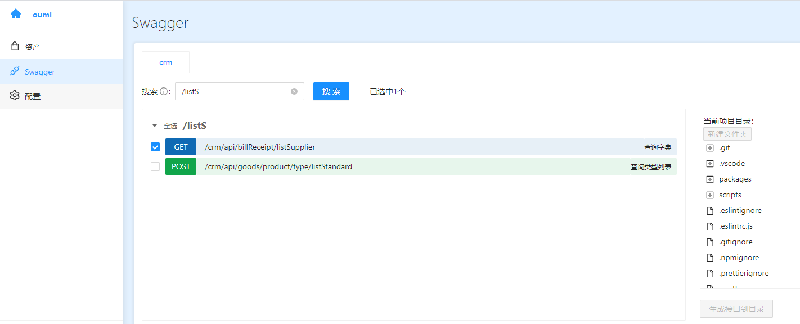

# @oumi/cli

## 安装
```
npm install -g @oumi/cli
# OR
yarn global add @oumi/cli
```

## 使用
```js
oumi ui
```


## 升级
```
npm update -g @oumi/cli
# OR
yarn global upgrade --latest @oumi/cli
```


## 预览 oumi ui
### 创建项目


### 资产
目前默认pro-blocks，且允许自定义[配置](https://www.yuque.com/qqhh/cuq2ci/vpg4rw)。


### Swagger


### 配置
